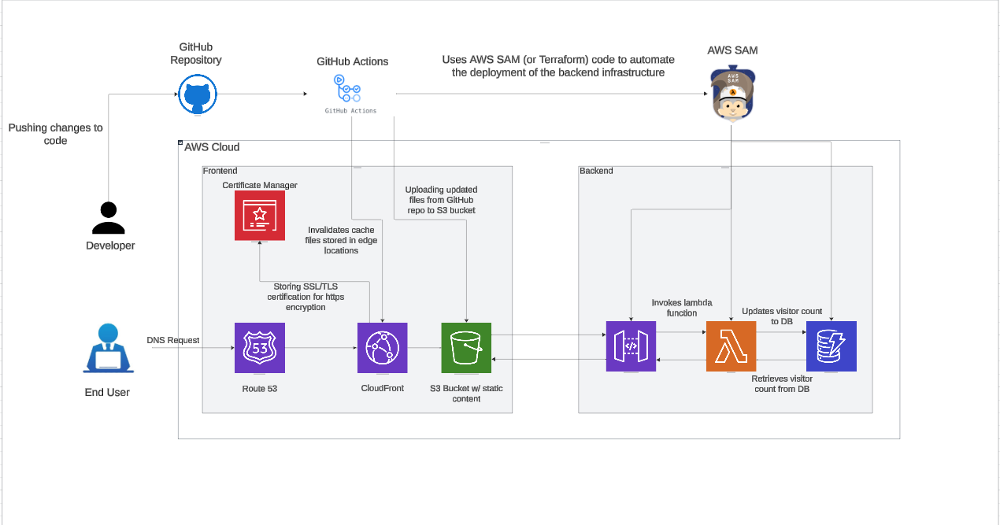

# AWS Cloud Resume Challenge
Welcome to my Cloud Resume Challenge project! This repository brings together frontend, backend, and infrastructure to create a fully functional serverless application hosted on AWS. This challenge is more than just a resume—it's a demonstration of cloud computing and automation skills.

# What this Project Includes
## Frontend
The website is visually appealing and functional, hosted globally on AWS.

__Files__:
* _index.html_: The main webpage structure.
* _script.js_: The logic powering the visitor counter.
* _styles.css_: Custom styling for a cleaner look.

__Hosting__: Delivered via S3 and ClouFront for fast, secure access.

## Backend
Serverless backend logic to keep track of website visitors.

__Features__:
* Updates a DynamoDB table, VisitorCounter, to count user website visits.
* Accessible through an HTTP API Gateway endpoint.

__Key Components__:
* _VisitorCounterFunction.py_: The lambda function logic.
* _TestLambdaFunction.py_: Unit tests to ensure backend reliability.
* _lambda.zip_: Packaged for deployment.

## Infrastructure
Infrastructure as Code (IaC) ensures everything is reproducible and scalable.

__Tools Used__: AWS Serverless Application Model (SAM).

__File__:
* _template.yml_: Defines all AWS resources in one place.

## CI/CD Pipelines
Automated deployments make sure the latest changes are live without maual effort.

__Frontend__: Syncs files to S3 and invalidates CloudFront cache, ensuring that the latest content is served.

__Backend__: Deploys Lambda function and updates infrastructure with AWS SAM.

# Resources Created
1. __S3 Bucket__: Hosts the static website.
2. __DynamoDB Table__: Tracks visits to the website.
3. __Lambda Function__: Updates the visitor counter when the website is visited via HTTP API.
4. __API Gateway__: Exposes the backend via an HTTP endpoint.
5. __CloudFront Distribution__: Secures and accelerates content delivery.
6. __ACM Certificate__: Provides HTTPS for the website.

# How It's Organized


This project uses a fully serverless architecture leveraging AWS services:
1. __Frontend__:
   * __S3 Bucket__: Hosts the static website.
   * __CloudFront Distribution__: Caches and serves the website globally, with HTTPS enabled using AWS Certificate Manager.
2. __Backend__:
   * __API Gateway__: Exposes an HTTP endpoint for the visitor counter functionality.
   * __Lambda Function__: Processes API requests and updates the visitor count in DynamoDB.
   * __DynamoDB Table__: Stores the visitor count with fields _id_ (partition key) and _views_ (integer count).
3. __Infrastructure__:
   * All resources are defined in the template.yml file using AWS SAM.
4. __CI/CD__:
   * __GitHub Actions__: Automates deployment for frontend (S3/CloudFront) and backend (Lambda/API Gateway).

# How to Deploy
__Prerequisites__:
1. Install AWS CLI and AWS SAM CLI.
2. Set up an AWS account with programmatic access.
3. Store GitHub secrets:
  * AWS_ACCESS_KEY_ID
  * AWS_SECRET_ACCESS_KEY

## Steps
__Manual Deployment__:
1. Frontend:
```yaml
aws s3 sync frontend/ s3://my-cloud-resume-challenge-website.com --delete
aws cloudfront create-invalidation --distribution-id <distribution-id> --paths "/*"
```
2. Backend:
```yaml
cd backend
zip -r lambda.zip VisitorCounterFunction.py
aws s3 cp lambda.zip s3://my-cloud-resume-challenge-website.com/
```
3. Infrastructure
```yaml
cd infrastructure
sam build
sam package --output-template-file packaged.yaml --s3-bucket my-cloud-resume-challenge-website.com
sam deploy --template-file packaged.yaml --stack-name CloudResumeChallengeStack --capabilities CAPABILITY_NAMED_IAM
```
__CI/CD Automation__
1. Add GitHub Secrets.
* AWS_ACCESS_KEY_ID
* AWS_SECRET_ACCESS_KEY

# Features
__Global Hosting__: S3 and CloudFront for fast, secure delivery.
__Visitor Counter__: Tracks and displays site visits using DynamoDB and Lambda.
__Infrastructure Automation__: Managed with AWS SAM for scalability.
__CI/CD__: GitHub Actions for automated deployments.

# Testing
__Frontend__:
* Open the CloudFront URL to verify the website works correctly.
* Refresh the page to see the visitor counter update.

__Backend__:
* Run TestLambdaFunction.py for unit tests.
* Use Postman or curl to tes the API Gateway endpoint (success should show just the visitor counter json, not full website).

# What's Next?
Coming soon to this project, I will be adding things like:
* User authentication for personalized visitor tracking.
* Set up monitoring and alerts for Lambda and DynamoDB.
* Integrate automated tests into the CI/CD pipeline.

# Thank You!
This project wouldn't have been possible without the inspiration from the Cloud Resume Challenge. It's been a rewarding experience blending web development, cloud infrastructure, and automation.

Feel free to explore, contribute, or use this as a starting point for your own cloud journey!


